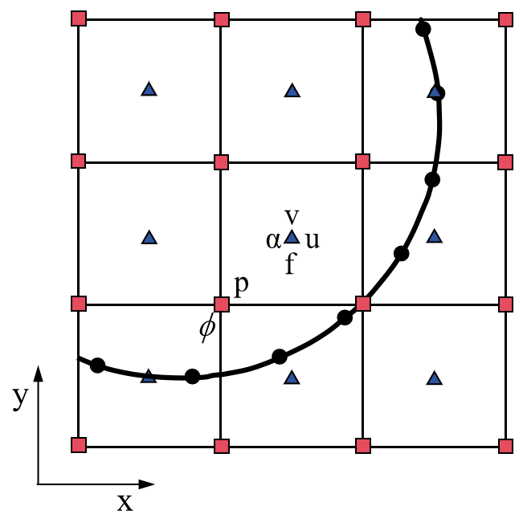

Direct Forcing Immersed Boundary Method
=======================================

This section presents the numerical discretization of :ref:`FluidEquationsPart`. The discretization of the fluid system on a single level is elucidated in :ref:`sec:TimeAdvancement`, followed by an examination of two distinct types of kinematic constraints in :ref:`sec:KinematicConstraints`.

.. _sec:TimeAdvancement:

Time advancement
----------------

.. _figSemiStaggeredGrid:

    Sketch of the two-dimensional semi-staggered grid and variable locations. The blue triangles, red squares, and black circles represent cell-centered variables, node-centered variables, and interface Lagrangian markers.

To solve the partial differential equations of :ref:`FluidEquationsPart`, the canonical projection :cite:`chorin1967numerical, almgren1998conservative` is
applied to the semi-staggered grid. As shown in :numref:`figSemiStaggeredGrid`, the fluid velocity (:math:`u` and :math:`v`), the Eulerian force :math:`f`, and particle volume fraction :math:`\alpha` are located at the cell center. The pressure :math:`p` and level set function :math:`\phi` are at the node center. The temporal and spatial discretizations of equations for single-level advancement are considered here. At the time :math:`t^{n}`, the Eulerian velocity :math:`\mathbf{u}^{n}` and pressure :math:`p^{n-1/2}` are known. The particle position :math:`\mathbf{X}^{n}_l` and velocity :math:`\mathbf{U}\left(\mathbf{X}^{n}_l\right)` are also available. The time advancement during the interval :math:`[t^{n}, t^{n+1}]` proceeds as follows.

**Step 1**: The intermediate velocity :math:`\widetilde{\mathbf{u}}^{*,n+1}` is solved semi-implicitly as

.. math::
    :label: eq:ns_lp

    \rho_{f}\left(\frac{\widetilde{\mathbf{u}}^{*,n+1}-\mathbf{u}^{n}}{\Delta t}+\nabla \cdot \left(\mathbf{u}\mathbf{u} \right)^{n+\frac{1}{2}}\right)=-\nabla p^{n-\frac{1}{2}}+\frac{1}{2}\left(\nabla \cdot \mu \nabla{\widetilde{\mathbf{u}}^{*,n+1}}+{\nabla} \cdot \mu \nabla {\mathbf{u}}^{n}\right)+\rho_{f}\mathbf{g}

where the convective term :math:`{\nabla} \cdot \left(\mathbf{u}\mathbf{u} \right)^{n+\frac{1}{2}}` is calculated using the second-order Godunov scheme. The Godunov algorithm has been proven to be a very robust method for handling conservation laws, especially for high Reynolds number flows. Many researchers who previously worked on incompressible fluid simulations have applied this method to deal with the convection terms in equations :cite:`almgren1998conservative,sussman1999adaptive, sverdrup2018highly`. In our previous work :cite:`zeng2022aparallel,zeng2022subcycling`, we provided a detailed derivation of the Godunov algorithm. In our recent work :cite:`zeng2023consistent`, we applied this algorithm to simulate two-phase flows at high Reynolds numbers (i.e., :math:`Re\approx 10^{6}`) and obtained stable and physically meaningful results. In this step, only the pure fluid system is solved and no particle-related influence is included.

.. _figinterpolation:

.. Figure:: ./AlgorithmAndSoftware/interpolation.png
    :align: center
    :width: 5.0in

    The number of markers change with the :math:`d/h` for a single particle scenario, where :math:`d` is the particle diameter and :math:`h` is the grid spacing.

**Step 2**: The updated velocity :math:`\widetilde{\mathbf{u}}^{*, n+1}` needs to be corrected to satisfy the no-slip boundary condition at the fluid–particle interfaces :math:`\partial V_{\mathrm{b}}(t)`. This step is divided into four substeps :cite:`kempe2012improved,breugem2012second` in Algorithm-1_. We first interpolate the intermediate Eulerian Velocity obtained from **Step 1** to the Lagrangian Velocity of markers. The Lagrangian forces are then calculated based on the desired velocity at the interface and the intermediate velocity. Next, the Eulerian forces are obtained from the spreading of Lagrangian forces by using either the three-point or four-point delta function :cite:`kempe2012improved,breugem2012second,zeng2022subcycling`. As shown in :numref:`figinterpolation`, the Eulerian cells, enclosed by red dashed circles, refer to grid areas that are influenced by two blue markers. These two Lagrangian markers also share some intersected areas, which are marked by green arrows. Finally, the Eulerian velocity is corrected by the updated Eulerian Force.

.. _figDLM_DFIBM:

.. Figure:: ./AlgorithmAndSoftware/DFIBM-DLM-Marker.png
    :align: center
    :width: 5.0in
    :name: test

    The number of markers change with the :math:`d/h` for a single particle scenario, where :math:`d` is the particle diameter and :math:`h` is the grid spacing.

In Algorithm-1_ mentioned above, four points need to be noted. First, the Lagrangian markers only exist on the finest level during the Eulerian-Lagrangian interaction process. This brings the benefits of memory saving since particle-related information does not need to be stored on coarser levels. Second, the Lagrangian markers only distribute on the surface of particles. This is different from the DLM method in others :cite:`bhalla2013unified,nangia2019dlm`, in which the markers also appear inside the particle and there is one marker per Eulerian grid cell. :numref:`figDLM_DFIBM` shows how the number of markers changes with the :math:`d/h` for a single particle scenario. It is seen that as :math:`d/h` increases, the present needs much fewer markers compared with the DLM method. Third, the multi-direct forcing algorithm includes an outer loop with :math:`m` ranging from 1 to :math:`N_{s}`, which controls the degree of coupling between Eulerian and Lagrangian variables. The original method of Uhlmann :cite:`uhlmann2005immersed` corresponds to the case of :math:`N_{s} = 0`. Increasing :math:`N_{s}` can enhance their coupling but will also increase the computational load. Based on the experience in the previous work :cite:`kempe2012improved,breugem2012second` and tests presented in this paper, it is sufficient to set :math:`N_{s}` to 2-3 for all cases in :ref:`Chap:Results`. Finally, if a system has multiple particles, each particle goes into 1 to :math:`N_{s}` loop sequentially. The corrected Eulerian forces we employ take into account the effects of all particles. This consideration also applies to the calculation of the particle volume fraction (PVF) field in :ref:`R-PVF`.

.. _Algorithm-1:

**Algorithm-1** : Multidirect forcing method for fluid-particle interaction

   1. :math:`\mathbf{u}^{(0)} = \widetilde{\mathbf{u}}^{*, n+1}`
   2. For :math:`m=1` to :math:`N_{s}`:

      a. Interpolate Lagrangian Velocity,
         :math:`\mathbf{U}^{m-1}\left(\mathbf{X}^{n}_l\right)=\sum_{i=1}^{N_x} \sum_{j=1}^{N_y} \sum_{k=1}^{N_z} \mathbf{u}^{(m-1)}\left(\mathbf{x}_{i, j, k}\right) \delta_h\left(\mathbf{x}_{i, j, k}-\mathbf{X}^{n}_l\right) h^3`
      b. Calculate Lagrangian Force,
         :math:`\mathbf{F}^{m}=\mathbf{F}^{m-1}+\left(\mathbf{U}^d\left(\mathbf{X}^{n}_l\right)-\mathbf{U}^{m-1}\left(\mathbf{X}^{n}_l\right)\right) / \Delta t`
      c. Spreading Lagrangian Force onto Eulerian Force,
         :math:`\mathbf{f}^{m}\left(\mathbf{x}_{i, j, k}\right)=\sum_{l=1}^{N_l} \mathbf{F}^{m}\left(\mathbf{X}_l\right) \delta_h\left(\mathbf{x}_{i, j, k}-\mathbf{X}_l\right) \Delta V_l`
      d. Correct Eulerian Velocity,
         :math:`\mathbf{u}^{(m)}=\mathbf{u}^{(0)}+\Delta t \mathbf{f}^{m}\left(\mathbf{x}_{i, j, k}\right)`
   3. :math:`{\mathbf{u}}^{*, n+1} = \mathbf{u}^{(m)}`

**Step 3**: With the updated intermediate velocity :math:`{\mathbf{u}}^{*, n+1}` in **Step 2**, a level projection operator is applied to obtain the updated pressure :math:`p^{n+1/2}` and velocity :math:`{\mathbf{u}}^{n+1}` fields. An auxiliary variable :math:`\boldsymbol{V}` is first calculated by

.. math::
   :label: eq:ns_lp1

   \boldsymbol{V} =  \frac{{\mathbf{u}}^{*,n+1}}{\Delta t} + \frac{1}{\rho_{f}} {\nabla} p^{n-\frac{1}{2}}.

Then, :math:`\boldsymbol{V}` is projected onto the divergence-free velocity field to obtain the updated pressure :math:`p^{n+1/2}` via

.. math::
   :label: eq:ns_lp2

   L^{cc,l}_{\rho_{f}} p^{n+1/2} =  {\nabla} \cdot \boldsymbol{V},

where :math:`L^{cc}_{\rho_{f}}p^{n+1/2}` is the density-weighted Laplacian operator to :math:`{\nabla} \cdot (1/\rho_{f}{\nabla} p^{n+1/2})` :cite:`almgren1998conservative,zeng2022aparallel`. Finally, the divergence-free velocity :math:`{\mathbf{u}}^{n+1}` on level :math:`l` is obtained as

.. math::
   :label: eq:ns_lp3

   {\mathbf{u}}^{n+1} = \Delta t \left(\boldsymbol{V} - \frac{1}{\rho_{f}} {\nabla} p^{n+1/2}\right).

The projection is stable and appears to be well-behaved in various numerical tests :cite:`almgren1996numerical,rider1995approximate` and practical applications :cite:`sussman1999adaptive,martin2000cell`.

**Step 4**:After completing **Step 3**, we obtain the divergence-free fluid velocity at :math:`t^{n+1}`. The particle-related information also needs to be updated from :math:`t^{n}` to :math:`t^{n+1}`. Depending on different kinematic constraints, the particle motion is categorized into prescribed motion and free motion. The specific updates are detailed in :ref:`sec:KinematicConstraints`.

.. _sec:KinematicConstraints:

Types of kinematic constraints
------------------------------

The approximation to the constrained Lagrangian velocity :math:`(\mathbf{U}_{\mathrm{b}})_{q, m}^{n+1}` and position :math:`\mathbf{X}_{q, m}^{n+1}` depends on the type of kinematic constraint in the FSI. In this work, we consider two types of kinematic constraints: prescribed motion of the particle and free motion of the particle.

Prescribed motion
~~~~~~~~~~~~~~~~~

If the motion of the particle is prescribed, then its velocity and position are known *a priori* and not influenced by the surrounding fluid. Thus, the centroid position :math:`\mathbf{X}_{r}^{n}`, centroid velocity :math:`\mathbf{U}_{r}^{n}` at :math:`t^{n}`, centroid velocity :math:`\mathbf{U}_{r}^{n+1}` at :math:`t^{n+1}`, and angular velocity :math:`\mathbf{W}_{r}^{n}` of the body are given. The desired velocity :math:`\mathbf{U}^d\left(\mathbf{X}^{n}_l\right)` of the markers in Algorithm-1_ is calculated as

.. math::
   :label: eq:pr1

   \mathbf{U}^d\left(\mathbf{X}^{n}_l\right)=\mathbf{U}_{r}^{n}+\mathbf{W}_{r}^{n} \times \mathbf{R}_l^n,

where :math:`\mathbf{R}_l^n = \left(\mathbf{X}^{n}_{l} - \mathbf{X}_{r}^{n}\right)`. The new position of the centroid of the particle :math:`\mathbf{X}_{r}^{n+1}` is updated using the midpoint scheme as

.. math::
   :label: eq:pr2

   \mathbf{X}_{r}^{n+1}=\mathbf{X}_{r}^{n}+\frac{\Delta t}{2}(\mathbf{U}_{r}^{n+1}+\mathbf{U}_{r}^{n}).

Free motion
~~~~~~~~~~~

In contrast to the prescribed kinematics case, the motion of a freely moving particle is influenced by the surrounding fluid. To account for this two-way interaction, the following governing equations of the particle systems are solved :cite:`kempe2012improved,breugem2012second`.

.. math::
    :label: eq:particle1

    \begin{equation}
    \label{particle1}
    \rho_p V_p \frac{d \mathbf{U}_r}{d t} \approx-\rho_f \sum_{l=1}^{N_L} \mathbf{F}_l^{n+1/2} \Delta V_l+\rho_f \frac{d}{d t}\left(\int_{V_p} \mathbf{u} d V\right) \\ +\left(\rho_p-\rho_f\right) V_p \mathbf{g}+\mathbf{F}_c^{n+1 / 2}
    \end{equation}

.. math::
    :label: eq:particle2

    \begin{equation}
    \label{particle2}
    I_p \frac{d \mathbf{W}_r}{d t} \approx-\rho_f \sum_{l=1}^{N_L} \mathbf{R}_l^n \times \mathbf{F}_l^{n+1 / 2} \Delta V_l \\ +\rho_f \frac{d}{d t}\left(\int_{V_p} \mathbf{r} \times \mathbf{u} d V\right)+\mathbf{T}_c^{n+1 / 2}
    \end{equation}

On the right-hand side of :eq:`eq:particle1`-:eq:`eq:particle2`, the term :math:`\mathbf{F}_l^{n+1/2}` refers to the Lagrangian Force, coming from the final value of :math:`\mathbf{F}^{m}` in Algorithm-1_. The time derivatives of momentum integration :math:`\rho_f \frac{d}{d t}\left(\int_{V_p} \mathbf{u} d V\right)` and angular momentum integration :math:`\rho_f \frac{d}{d t}\left(\int_{V_p} \mathbf{r} \times \mathbf{u} d V\right)` within the particle are also included. These two integrated terms account for flow unsteadiness by using the PVF field (:ref:`R-PVF`). The term :math:`\left(\rho_p-\rho_f\right) V_p \mathbf{g}` considers the buoyancy effects. The terms :math:`\mathbf{F}_c^{n+1 / 2}` and :math:`\mathbf{T}_c^{n+1 / 2}` refer to the induced force and torque generated by the particle collision, respectively. If there is only one single particle in the system, both :math:`\mathbf{F}_c^{n+1 / 2}` and :math:`\mathbf{T}_c^{n+1 / 2}` are set to be zero. On the left-hand side of :eq:`eq:particle1`-:eq:`eq:particle2`, we use the second-order mid-point scheme to integrate particle motions :cite:`zhu2022particle`. After updating the particle centroid velocity :math:`\mathbf{U}_{r}^{n+1}` and angular velocity :math:`\mathbf{W}_{r}^{n+1}` at :math:`t^{n+1}`, we go back to :eq:`eq:pr2` to update new position of the particle centroid :math:`\mathbf{X}_{r}^{n+1}`.

The time advancement scheme in this work is not fully implicit :cite:`zhu2022particle`, yet it can deal with the free motion applies to particles either with a large density ratio (i.e., :math:`\frac{\rho_p}{\rho_f} \geq 10`) or a small density ratio (i.e., :math:`\frac{\rho_p}{\rho_f} \approx 1.5 - 2`) :cite:`kempe2012improved,breugem2012second`. We found it is robust and fast enough to handle all the testing cases in :ref:`Chap:Results`. Before ending this Section, we also emphasize that our method is similar to the "weak coupling" method used in the sharp-interfaced immersed boundary method, which requires only one solution for fluid and solid solver during each time step and no iterations are needed between these two solvers :cite:`balaras2009adaptive,cui2018sharp`. It is easier to extend the current portable solver to the "strong coupling" method, which then re-projects the flow part, re-updates the solid particle, and performs a convergence checking between the fluid solver and the solid solver during each sub-iteration :cite:`he2022numerical,zeng2022subcycling`.
