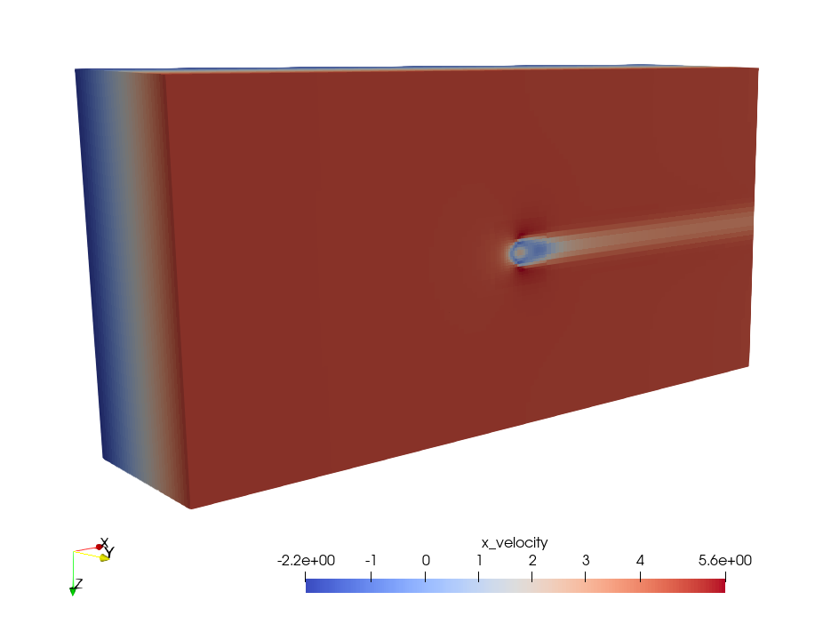

.. _Chap:GettingStarted:

Getting Started
===============
This section walks you through a brief introduction to using IAMReX.

Downloading the code
--------------------
IAMReX is built on top of the AMReX framework. In order to run
IAMReX, you must download separate git modules for IAMReX, AMReX
and AMReX-Hydro.

First, make sure that git is installed on your machine.

#. Download the AMReX repository by typing:

   .. code:: shell

        git clone https://github.com/ruohai0925/amrex.git

   This will create a folder called ``amrex/`` on your machine.

#. Download the AMReX-Hydro repository by typing:

   .. code:: shell

        git clone https://github.com/ruohai0925/AMReX-Hydro.git

   This will create a folder called ``AMReX-Hydro/`` on your machine.

#. Download the IAMReX repository by typing:

   .. code:: shell

        git clone https://github.com/ruohai0925/IAMReX.git

   This will create a folder called ``IAMReX/`` on your machine.

After cloning, one will have three folders in your current directory: ``AMReX``, ``AMReX-Hydro``, ``IAMReX``.

Building the code
-----------------

We recommend using the GNU compiler to compile the program on the Linux platform. The compilation process requires preparing a make file, which you can find in the example folder under Tutorials. It is strongly recommended to use the GNUmakefile prepared in advance by the example. If you want to know more about the configuration information of the compilation parameters, you can check it in the `AMReX building <https://amrex-codes.github.io/amrex/docs_html/BuildingAMReX.html>`_.

For example, if we want to compile in the ``FlowPastSphere``, refer to the following steps:

#. cd to the FlowPastSphere directory

    .. code:: shell

        cd IAMReX/Tutorials/FlowPastSphere

#. Modify compilation parameters in GNUmakefile.

    The compilation parameters depend on your computing platform. AMReX uses an **MPI+X** strategy, where **MPI** distributes work across nodes (and GPUs), and **X** is a node-level parallelization backend—on GPUs, this is typically **CUDA**

    - Use the following flags:
        - `USE_MPI=TRUE` to enable MPI
        - `USE_CUDA=TRUE` to enable CUDA
        - `CUDA_ARCH=XX` to specify the CUDA architecture (e.g., 80 for Ampere)

    For more information on setting up MPI and CUDA environments, please refer to: `OpenMPI <https://docs.open-mpi.org>`_, `MPICH <https://www.mpich.org/documentation/guides/>`_, `IntelMPI <https://www.intel.com/content/www/us/en/developer/tools/oneapi/mpi-library.html>`_, and `CUDA <https://developer.nvidia.com/cuda-toolkit>`_.

#. Compile

    With the above settings, you can compile the program:

    .. code:: shell

        make

    You can add parameters after make, such as -f your_make_file to customize your parameter file, and -j 8 to specify 8 threads to participate in the compilation.

If the compilation is successful, an executable file will be generated. Usually the executable file is named in the following format:amr[DIM].[Compiler manufacturers].[computing platform].[is Debug].ex. The executable file name of the Release version of the three-dimensional compiled using the GNU compiler in the MPI environment is: amr3d.GNU.MPI.ex.

Running the code
----------------
You should take an input file as its first command-line argument. The file may contain a set of parameter definitions that will overrides defaults set in the code. In the ``FlowPastSphere``, you can find a file named ``inputs.3d.flow_past_sphere``, run:

    .. code:: shell

        ./amr3d.GNU.MPI.ex inputs.3d.flow_past_sphere

If you use ``MPI`` to run your program, you can type:

    .. code:: shell

        mpirun -np how_many_processes amr3d.GNU.MPI.ex inputs.3d.flow_past_sphere

This code typically generates subfolders in the current folder that are named ``plt00000``, ``plt00010``, etc, and ``chk00000``, ``chk00010``, etc. These are called **plotfiles** and **checkpoint** files. The plotfiles are used for visualization of derived fields; the checkpoint files are used for restarting the code.

Visualization
--------------

Various tools are available for data postprocessing and visualization, one can check `AMReX <https://erf.readthedocs.io/en/latest/Visualization.html>`_ for reference. As for the specific settings and output content, `IAMR <https://amrex-fluids.github.io/IAMR/RunningProblems.html#output-options>`_ also provides more details.

Since IAMReX uses the native plotfile format, the particle data is generated as CSV files in the same case directory following the naming convention ``IB_Particle_<ID>.csv``

    To visualize plotfiles, use ParaView to process and display the results.

The plotfiles include the quantities of several simulation parameters as output (density, gradpx, gradpy, gradpz, x_velocity, y_velocity, z_velocity and tracer).

Furthermore, particle data processing scripts are provided herein `IBParticle2VTK <https://github.com/S-Explorer/IBParticle2VTK>`_. These utilities enable conversion of particle **CSV** files to **VTK** format, facilitating further analysis in ParaView.

.. _sec:PhysicsParams:

Key parameters
---------------

.. tip::
    One can also find more parameters in the `IAMR guide <https://amrex-fluids.github.io/IAMR/SetupAndRunning.html>`_.

.. list-table:: NavierStokes parameters
   :widths: 40 100 20 20
   :header-rows: 1

   * -
     - Description
     - Type
     - Default
   * - do_diffused_ib
     - enable IBM
     - Int
     - 0
   * - fluid_rho
     - density of fluid
     - Real
     - 1.0

The above parameters are designed for the immersed boundary (IB) method. Additionally, the ``particle.input`` flag (such as ``particle_inputs``) must be specified to define IB-related parameters. The program will query these parameters through this flag. The specific parameters include the following:

.. list-table:: DiffusedIB parameters
   :widths: 40 100 20 20
   :header-rows: 1

   * -
     - Description
     - Type
     - Default
   * - x
     - particle x position
     - Real Array
     - 0.0
   * - y
     - particle y position
     - Real Array
     - 0.0
   * - z
     - particle z position
     - Real Array
     - 0.0
   * - rho
     - density of particles
     - Real Array
     - 1.0
   * - radius
     - radius of particles
     - Real Array
     - 0.0
   * - velocity_x
     - The initial velocity of the particles in the x direction
     - Real Array
     - 0.0
   * - velocity_y
     - The initial velocity of the particles in the y direction
     - Real Array
     - 0.0
   * - velocity_z
     - The initial velocity of the particles in the z direction
     - Real Array
     - 0.0
   * - omega_x
     - The initial angular velocity of the particle around the x-axis
     - Real Array
     - 0.0
   * - omega_y
     - The initial angular velocity of the particle around the y-axis
     - Real Array
     - 0.0
   * - omega_z
     - The initial angular velocity of the particle around the z-axis
     - Real Array
     - 0.0
   * - TLX
     - Particle freedom in x-direction
     - Int Array
     - 0
   * - TLY
     - Particle freedom in y-direction
     - Int Array
     - 0
   * - TLZ
     - Particle freedom in z-direction
     - Int Array
     - 0
   * - RLX
     - Particle rotation about x-axis
     - Int Array
     - 0
   * - RLY
     - Particle rotation about y-axis
     - Int Array
     - 0
   * - RLZ
     - Particle rotation about z-axis
     - Int Array
     - 0
   * - RD
     - particle retraction distance
     - Real
     - 0.0
   * - write_freq
     - How many steps to export the particle information
     - Int
     - 1
   * - LOOP_NS
     - Ns loop time
     - Int
     - 2
   * - LOOP_SOLID
     - particle update steps
     - Int
     - 1
   * - start_step
     - How much steps does it take for the particles to move
     - Int
     - -1
   * - collision_model
     - particle collision model
     - Int
     - 1.0
   * - verbose
     - Whether to output debug information
     - Int
     - 0
   * - init
     - particle init file path
     - file path
     -

Checkpoints are used to resume simulations. You typically need to specify how often to save checkpoint files. To restart a simulation from a particular checkpoint, you must specify it in the ``restart`` parameters. These settings are usually defined under the ``amr`` field.

::

    # how many timestep frequency to save checkpoint files
    amr.check_int = 4000
    # which checkpoint file to restart
    amr.restart = chk00010

Among above parameters, array-type parameters are used to specify parameters for multiple particles individually, or define particle positions via an init file (e.g., a precomputed position data file).
If particle positions are provided through an external file, other array-type parameters only need to provide a single value, which will be applied to all particles uniformly.

Example inputs file:

::

    #*******************************************************************************
    # INPUTS.3D.FLOW_PAST_SPHERE
    #*******************************************************************************

    #NOTE: You may set *either* max_step or stop_time, or you may set them both.

    # Maximum number of coarse grid timesteps to be taken, if stop_time is
    #  not reached first.
    max_step 		= 2

    # Time at which calculation stops, if max_step is not reached first.
    stop_time 		= 100.0

    ns.fixed_dt     = 0.01
    ns.cfl = 0.3
    ns.init_iter = 0

    # Diffused IB input file
    particle.input = particle_inputs

    # Refinement criterion, use vorticity and presence of tracer
    amr.refinement_indicators = tracer

    amr.max_level		= 0 # maximum number of levels of refinement
    # amr.tracer.value_greater = 0.1
    # amr.tracer.value_less = 1.1
    amr.tracer.field_name = tracer
    amr.tracer.in_box_lo = 0.5 0.5 0.5
    amr.tracer.in_box_hi = 1.5 1.5 1.5

    amr.blocking_factor     = 8

    #*******************************************************************************

    # Number of cells in each coordinate direction at the coarsest level
    # amr.n_cell 		= 16 8 8
    amr.n_cell 		= 256 128 128
    # amr.n_cell 		= 288 128 128
    amr.max_grid_size	= 16
    # amr.max_grid_size	= 32

    #*******************************************************************************

    # Interval (in number of level l timesteps) between regridding
    amr.regrid_int		= 1 # regrid_int

    #*******************************************************************************

    # Refinement ratio as a function of level
    amr.ref_ratio		= 2 2 2 2

    #*******************************************************************************

    # Sets the "NavierStokes" code to be verbose
    ns.v                    = 1
    nodal_proj.verbose      = 1
    mac_proj.verbose        = 1

    # mac_proj.mac_tol        = 0.1
    # mac_proj.mac_abs_tol    = 0.1

    #*******************************************************************************

    # Sets the "amr" code to be verbose
    amr.v                   = 1

    #*******************************************************************************

    # Interval (in number of coarse timesteps) between checkpoint(restart) files

    amr.check_int		= 4000

    #amr.restart             = chk01400

    #*******************************************************************************

    # Interval (in number of coarse timesteps) between plot files
    amr.plot_int		= 1

    #*******************************************************************************

    # Viscosity coefficient
    ns.vel_visc_coef        = 0.01

    #*******************************************************************************

    # Diffusion coefficient for first scalar
    ns.scal_diff_coefs      = 0.0

    #*******************************************************************************

    # Forcing term defaults to  rho * abs(gravity) "down"
    ns.gravity              = 0.0 # -9.8

    #*******************************************************************************

    # skip level_projector
    ns.skip_level_projector = 0

    #*******************************************************************************

    # subcycling vs. non-subcycling
    amr.subcycling_mode     = None

    #*******************************************************************************

    # Set to 0 if x-y coordinate system, set to 1 if r-z.
    geometry.coord_sys   =  0

    #*******************************************************************************

    # Physical dimensions of the low end of the domain.
    geometry.prob_lo     =  0. 0. 0.

    # Physical dimensions of the high end of the domain.
    geometry.prob_hi     =  20. 10. 10.

    #*******************************************************************************

    #Set to 1 if periodic in that direction
    geometry.is_periodic =  0 1 1

    #*******************************************************************************

    # Boundary conditions on the low end of the domain.
    ns.lo_bc             = 1 0 0

    # Boundary conditions on the high end of the domain.
    ns.hi_bc             = 2 0 0

    # 0 = Interior/Periodic  3 = Symmetry
    # 1 = Inflow             4 = SlipWall
    # 2 = Outflow            5 = NoSlipWall

    # Boundary condition
    xlo.velocity            =   1.  0.  0.

    #*******************************************************************************

    # Problem parameters
    prob.probtype = 1

    #*******************************************************************************

    # Add vorticity to the variables in the plot files.
    # amr.derive_plot_vars    = avg_pressure

    #*******************************************************************************
    ns.isolver            = 1
    ns.do_diffused_ib     = 1
    ns.fluid_rho          = 1.0

    #ns.sum_interval       = 1

    particles.do_nspc_particles = 0

    nodal_proj.proj_tol = 1.e-8
    nodal_proj.proj_abs_tol = 1.e-9

    nodal_proj.maxiter = 200
    nodal_proj.bottom_maxiter = 200

    mac_proj.mac_tol = 1.e-8
    mac_proj.mac_abs_tol = 1.e-9

    ############################
    #                          #
    #  Diffused IB cfg file    #
    #                          #
    ############################

    # particle's location
    # x = p1x p2x p3x ...
    particle_inputs.x = 5.0
    particle_inputs.y = 5.0
    particle_inputs.z = 5.0

    # particle's density
    # rho = p1r p2r p3r ...
    particle_inputs.rho = 1.0

    # particle's radius
    # single
    particle_inputs.radius = 0.5

    # particle's velocity
    # vx = p1vx p2vx p3vx ...
    particle_inputs.velocity_x = 0.0
    particle_inputs.velocity_y = 0.0
    particle_inputs.velocity_z = 0.0

    # particle's omega
    # omega = p1omega_x p2omega_x p3omega_x ...
    particle_inputs.omega_x = 0.0
    particle_inputs.omega_y = 0.0
    particle_inputs.omega_z = 0.0

    # particle's 6DOF
    # TLX = p1tl p2tl ...
    particle_inputs.TLX = 0
    particle_inputs.TLY = 0
    particle_inputs.TLZ = 0
    particle_inputs.RLX = 0
    particle_inputs.RLY = 0
    particle_inputs.RLZ = 0

    # msg print
    particle_inputs.verbose = 1

If you want to know more about the parameters, you can check the `AMReX <https://amrex-codes.github.io/amrex/docs_html/>`_.
