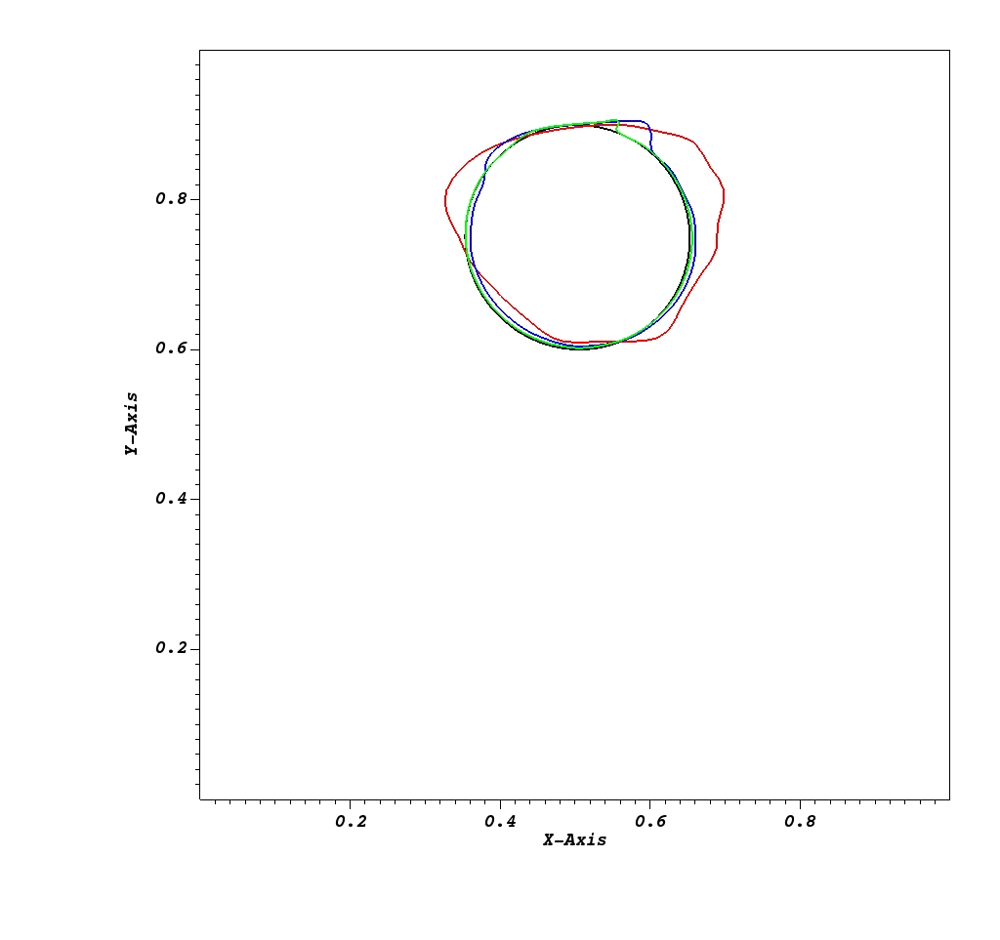
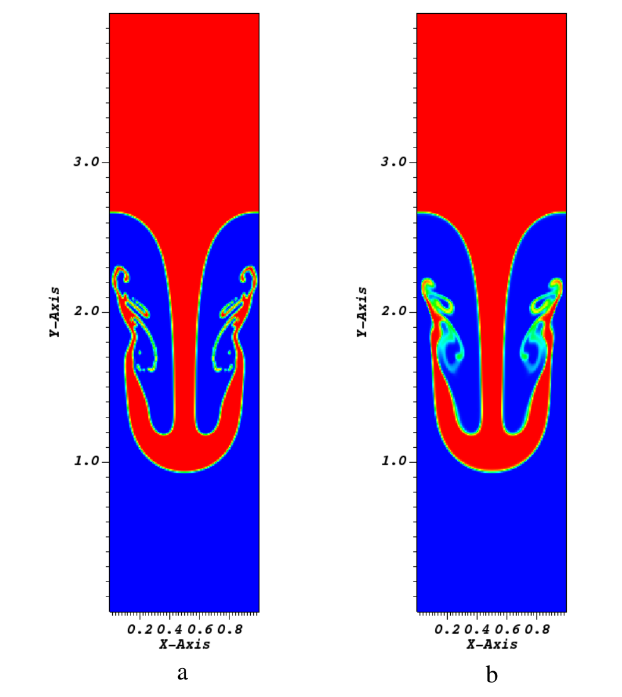
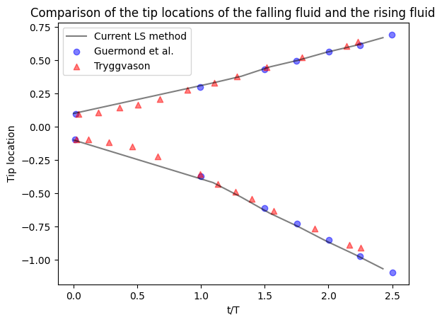
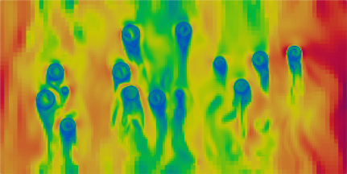

Introduction
===================

This IAMReX repo extends the capability of original `IAMR <https://amrex-fluids.github.io/IAMR/>`_ codes, aiming at simulating the multiphase incompressible flows and fluid structure interaction problems on both CPUs and GPUs with/without subcycling. The Navier-Stokes equations are solved on an adaptive semi-staggered grid using the projection method. The gas-liquid interface is captured using the level set (LS) method. The fluid-solid interface is resolved using the multidirect forcing immersed boundary method (IBM). The particle-wall as well as the particle-particle collisions are also captured by the adaptive collision time model (ACTM).

Features
------------------

Key software and algorithmic features of IAMR include:

* LS method and reinitialization schemes

* Multidirect forcing Immersed Boundary Method

* Particle Collision Algorithms with Discrete Element Method

Sample Cases
------------------

In the first case, we test the order of convergence for in a 2D reversed single vortex problem.
A 2D circular drop with radius R=0.15 is placed at (0.5,0.75) in a unit computational domain [0, 1] x [0, 1].
The velocity field is given by the stream function,

   .. math::
      :label: eq:stream_function

      \Psi(x, y, t)=\frac{1}{\pi} \sin ^{2}(\pi x) \sin ^{2}(\pi y) \cos \left(\frac{\pi t}{T}\right),

in which the rotational period is :math:`T=4.0`. The velocities in the :math:`x` and :math:`y` directions are defined as :math:`u(x,y,t)=\partial \Psi / \partial y` and :math:`v(x,y,t)=-\partial \Psi / \partial x`, respectively.
The periodic boundary condition is applied in both x and y directions. At t=T, the interfacial profile of the drop at the high resolution converges to its initial profile, which represents the exact solution.
On the other hand, the circular shape of the drop is distorted for the simulation with low resolution.
Here is the case directory: `RSV <https://github.com/ruohai0925/IAMReX/tree/development/Tutorials/RSV>`_.

    Profiles of drop interface in the Reverse Single Vortex (RSV) problem at t/T=1 after one rotation. Black line: Analytical Solution; Red line: 64*64; Blue line: 128*128; Green line: 256*256

The second Rayleigh--Taylor (RT) instability case is simulated here to validate the adaptive two-phase flow algorithms when small vorticity structures are involved.
This instability phenomenon occurs for any perturbation to the interface between a lighter fluid (:math:`\rho_2`) at the bottom and a heavier fluid (:math:`\rho_1`) at the top.
In the simulation, the computational domain is :math:`[0,1] \times [0,4]`. The initial interface is given by :math:`y(x)=2.0+0.1\cos(2\pi x)`.
The density ratio is set to :math:`\lambda=\rho_2/\rho_1=1/3` and the Reynolds number is set to be :math:`Re=\rho_1 g^{1/2}/\mu_1=3000`. Here is the case directory: `RayleighTaylor <https://github.com/ruohai0925/IAMReX/tree/development/Tutorials/RayleighTaylor_LS>`_.

    Density profile: a. Density profile at t/T=2.42 using Level Set (LS) method with sharp interface. b. Density profile at t/T=2.42 using IAMReX convective method with diffuse interface.
    One can see that the former is more accurate than the latter to capture the details of the interface.

The evolution of the air--water interface is shown in the above Figure. Compared with previous work, our algorithms can also accurately capture the transient locations of the fluid appearing in the Rayleigh--Taylor instability problem.
For more details of this case, one can check our previous work :cite:`zeng2022aparallel`.

    Comparison of the tip locations of the falling fluid and the rising fluid with the previous work :cite:`guermond2000projection, tryggvason1988numerical`.

The third case refers to fluid-particle interactions with 80 randomly distributed particles in a channel. The following Figure represents the velocity contour of an interface in the x direction at the steady state.
The flow passes around the particles and generates the wakes behind.
Here is the case directory: `Monodisperse <https://github.com/ruohai0925/IAMReX/tree/development/Tutorials/Monodisperse>`_.
For more details of this case, one can check :ref:`sec:ClusterParticles`.

    Contours of velocity magnitude in yz plane

All input scripts and raw postprocessing data of IAMReX have been uploaded into `Baidu Cloud <https://pan.baidu.com/s/1bZRoDunjBv7bqYL8CI3ASA?pwd=i5c2>`_ for interested readers to reproduce the results.
