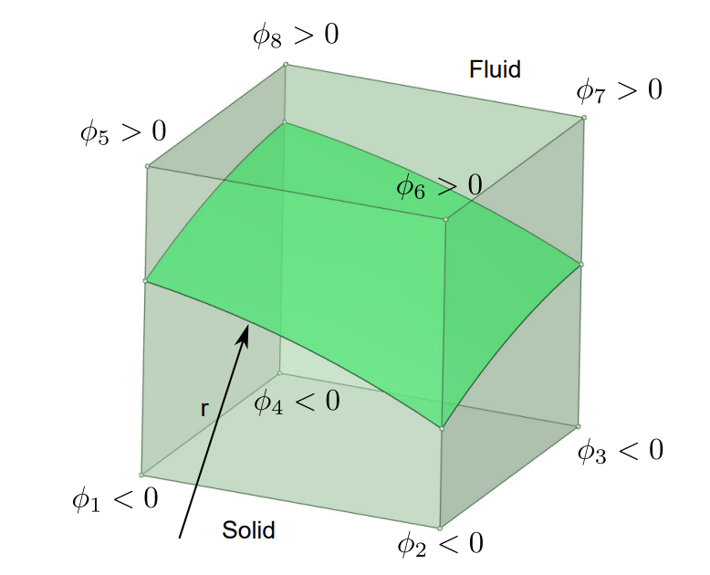
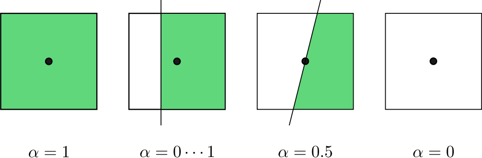
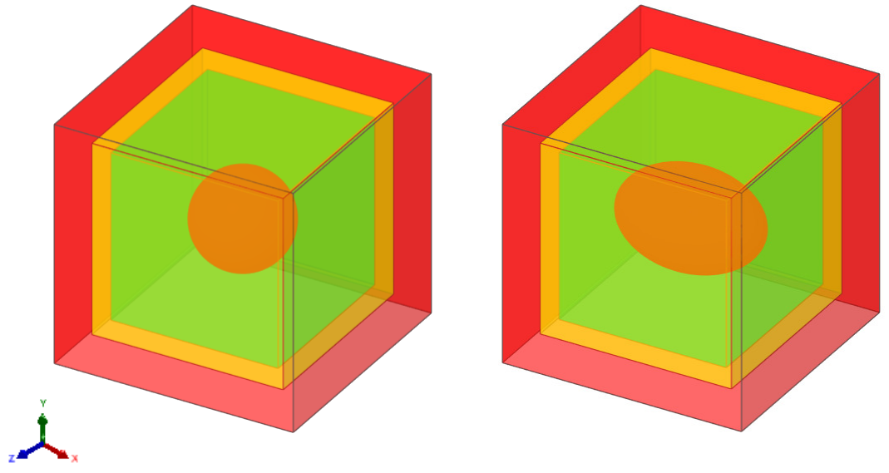
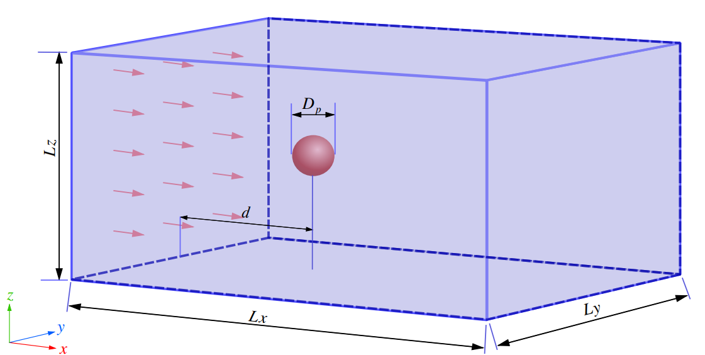
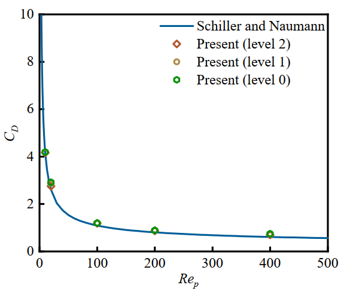
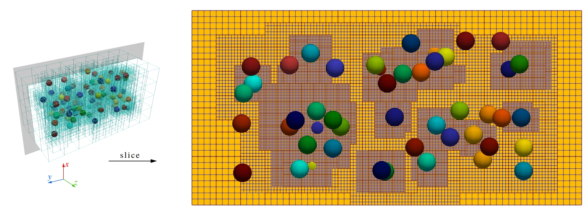
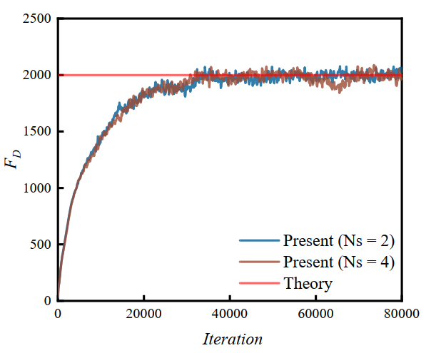

.. _Chap:Results:

Validation Cases
================

.. _R-PVF:

Particle Volume Fraction (PVF)
------------------------------

The particle volume fraction (PVF), which joins the calculation of free motion updates, is introduced and validated in this session. The PVF is approximated by the signed-distance level-set function :math:`\phi` of the fluid-particle interface. The level-set function :math:`\phi` is located at cell nodes and is calculated at the eight corners of each cell. The symbol of :math:`\phi` as well as the intersected interface is shown in :numref:`figPvfLevelSet`. Here, :math:`\phi` is negative inside the particle and positive outside the particle.

.. _figPvfLevelSet:

    Sketch of :math:`\phi` at each corner of a grid cell with interface.

Based on the level-set function :math:`\phi`, an approximation of PVF can be obtained by the following equation:

.. math::

   \alpha_{i,j,k} = \frac{\sum_{m=1}^{8}-\phi_mH(-\phi_m)}{\sum_{m=1}^8|\phi_m|},

where :math:`H` is the Heaviside function, defined by:

.. math::

   H(\phi) =
   \begin{cases}
   0, & \phi \le 0\\
   1, & \phi > 0
   \end{cases}

On the right-hand side of equation :math:`\alpha_{i,j,k}`, the value of :math:`\phi` for each cell corner depends on the location of the fluid-particle interface. When the shape of the particle surface is analytically given, the :math:`\phi` value can be determined by calculating the Euclidean distance from the corner point of the cell to the particle surface. The calculation of PVF is then transformed from an exact integral to a numerical integral. As shown in :numref:`figPvfCase`, the cell value of PVF varies from :math:`0` to :math:`1`, depending on the relative position between the cell center and the fluid-particle interface.

.. _figPvfCase:

    Sketch of PVF with different values. The white and green colors refer to the cell areas within the fluid and particle, respectively.

We validate the correctness and convergence of the above PVF approximation by calculating the volumes of spherical and ellipsoidal surfaces on the Cartesian grid. The exact solutions for the sphere and ellipsoid are given by:

.. math::
   :label: equ:exact solutions of the sphere and ellipsoid

   V_{exact} = 4\pi \frac{abc}{3}

where :math:`a`, :math:`b`, and :math:`c` are the semi-axes of the ellipsoid. For a sphere case, we have :math:`a=b=c`. The signed-distance level-set function is:

.. math::
   :label: equ:level-set function of spheroidal geometries

   \phi_{i,j,k}= \sqrt{\frac{(x_{i,j,k}-x_{p})^2}{a^2} + \frac{(y_{i,j,k}-y_{p})^2}{b^2} + \frac{(z_{i,j,k}-z_{p})^2}{c^2}}-1,

for any Eulerian cell :math:`(i,j,k)`. The computational domain is :math:`L_x \times L_y \times L_z = 2 \times 2 \times 2`, the sphere diameter is :math:`D = 0.8`, and the semi-axes of the ellipsoid are set to be :math:`a = 0.4`, :math:`b = 0.6`, :math:`c = 0.4`. The centers of both particles are :math:`(x_p, y_p, z_p)=(1,1,1)`. As shown in :numref:`figPvfAmr`, three levels of AMR grid are used during the PVF calculation, and the particles are enclosed by the finest level.

.. _figPvfAmr:

    Results of a three-level AMR grid. The red, orange, and green color represents the grid on levels 0, 1, and 2, respectively. Left: a spherical particle; Right: an ellipsoidal particle.

.. table:: Calculate sphere volume fraction by using a three-level AMR grid
   :name: tab:pvf result of sphere

   +-------+----------------+-------------------+-----------+
   | d/h   | Volume         | ε_sphere [%]      | s_sphere  |
   +=======+================+===================+===========+
   | 16    | 0.2667230796   | 5.071·10⁻¹        |           |
   +-------+----------------+-------------------+-----------+
   | 32    | 0.2677639589   | 1.188·10⁻¹        | 2.09374   |
   +-------+----------------+-------------------+-----------+
   | 64    | 0.2679990393   | 3.116·10⁻²        | 1.93077   |
   +-------+----------------+-------------------+-----------+
   | 128   | 0.2680627154   | 7.407·10⁻³        | 2.07273   |
   +-------+----------------+-------------------+-----------+

.. table:: Calculate ellipsoid volume fraction by using a three-level AMR grid
   :name: tab:pvf result of ellipsoid

   +-------+----------------+---------------------+-------------+
   | d/h   | Volume         | ε_ellipsoid [%]     | s_ellipsoid |
   +=======+================+=====================+=============+
   | 16    | 0.4004903567   | 4.062·10⁻¹          |             |
   +-------+----------------+---------------------+-------------+
   | 32    | 0.4016884973   | 1.083·10⁻¹          | 1.90716     |
   +-------+----------------+---------------------+-------------+
   | 64    | 0.4020166444   | 2.666·10⁻²          | 2.02228     |
   +-------+----------------+---------------------+-------------+
   | 128   | 0.40209828964  | 6.359·10⁻³          | 2.0678      |
   +-------+----------------+---------------------+-------------+

The numerical errors decrease with the increase of the :math:`d/h`, where :math:`h` is the Cartesian grid spacing on level :math:`0`. If the resolution on the finest level keeps unchanged, we validated that the results of a three-level grid are the same as those of the corresponding single-level grid. In addition, our results show the second-order convergence and agree well with the results in Kempe :cite:`kempe2012improved`. It also matches the overall second-order accuracy of the basic fluid solver.

Lastly, it is noted that this method is also applicable when multiple particles are close to each other or their surfaces are in direct contact. Because the PVF calculation is a separate operation for each particle, the total volume fraction is not needed as long as the Eulerian force considers the effects of all particles .

Flow Past Sphere
----------------------

    The schematic of the flow passing through the spherical particles

We validate the accuracy and efficacy of our adaptive solver by simulating a spherical particle in uniform flow with different particle Reynolds numbers :cite:`schiller1933uber,zhu2022particle`. The diameter of the particle is :math:`D_p = 1`, the computational domain is :math:`L_x \times L_y \times L_z = 20D_p \times 10D_p \times 10D_p`, the distance of the particle from the inlet is :math:`d = 5D_p` and located in the center of the yz plane. The inlet and outlet boundaries are applied in the x direction and the inlet velocity :math:`U` is :math:`1m/s`. Both y and z directions are periodic boundaries.

The influence of AMR on the simulation results is investigated by using the subcycling method with different levels. As shown in Fig.

    The drag coefficient of the particle under uniform flows varies with Particle Reynolds number at different AMR levels.

Three different types of grid were selected: level 0 indicates the single-level grid containing no AMR, level 1 indicates the two-level grid, and level 2 indicates the three-level grid. For all three types of grid, the ratio of the diameter of the particles to the grid spacing on the finest level is 16. The drag force, including the contributions of Lagrangian force and the PVF function, is calculated by

.. math::
    \mathbf{F}_D=-\rho_f \sum_{l=1}^{N_L} \mathbf{F}_l^{n+1/2} \Delta V_l+\rho_f \frac{d}{d t}\left(\int_{V_p} \mathbf{u} d V\right),

The theoretical S-N law for calculating the drag coefficient of the shaped particles is

.. math::
    C_D = (24/Re_p)(1+0.15Re_p^{0.687}),

which is proposed by Schiller :cite:`schiller1933uber`., and :math:`Re_p = UD_p/\nu` represents the particle Reynolds number. It can be seen from above Fig that the present results under different particle Reynolds numbers are in good agreement with S-N law. The fact that different levels of grid produce the nearly identical results validated the accuracy of our solver on the adaptive grid.

.. _sec:ClusterParticles:

Cluster of monodisperse particles
---------------------------------

We demonstrate the accuracy and efficacy of our codes for simulating clusters of particles on the multi-level grid. As shown in Fig.

    Monodisperse particles on a three-level AMR grid

80 particles of diameter :math:`D = 1` are randomly distributed in a channel of size :math:`L_x\times L_y \times L_z = 10\times 20 \times 10`. To choose an optimal interaction number :math:`N_s` in this complex configuration, the maximum error of the no-slip boundary condition among 80 particles is tested with a unit flow field :math:`u=(1,0,0)`.the maximum error of no-slip condition decreases as :math:`N_s` increases and it is strongly reduced for :math:`N_s=2`. According to the selection suggestions provided by Breugem :cite:`breugem2012second`. :math:`N_s=2` is the optimal value for balancing the accuracy of the no-slip boundary and the computational efficiency. After determining :math:`N_s`, the fluid flow is driven by applying a pressure gradient of 1.0 in the z direction. This case can represent a porous medium with a volume fraction of 0.02. Three levels of the AMR grid is applied. The grid resolution on the finest level is :math:`d/h=16`. Since the multi-direct forcing immersed boundary method :cite:`kidanemariam2022open,yousefi2023role` and fictitious domain method :cite:`xia2020effects,fan2023three` require cube grid cells, the grid cell requirement is equals to case 1 in Table.

    +------+---------+---------+---------+-------------+
    | case | level 0 | level 1 | level 2 | Total cells |
    +======+=========+=========+=========+=============+
    |   1  | 8192000 |         |         |   8192000   |
    +------+---------+---------+---------+-------------+
    |   2  |  128000 |  534656 | 1593664 |   2256320   |
    +------+---------+---------+---------+-------------+

Compared with them, our algorithm has a 72.5% grid reduction with :math:`d/h=16`. And it has a 62.5% Lagrangian markers reduction compared with the DLM method :cite:`sharma2022coupled,zeng2022subcycling` with :math:`d/h=16`.

When the simulation reaches the steady state, the total pressure drop balances the IB force generated by all particles in the streamwise z direction. Following the equation in akiki et al., the theoretical drag force is given by

.. math::
    F_{theory} = (\frac{\Delta p}{\Delta z}L_z)L_xL_y

Fig. shows the time series of total IB force for all particles. The resistance gradually reaches a steady state after 40000 steps. In this case, the theoretical value of drag force given by :math:`F_{theory}` is 2000, while the present average values at steady state with :math:`N_s=2` and 4 are all converged around 2000. It indicates that :math:`N_s=2` is sufficient for this case. And the agreement between theory and present results validates the accuracy of our proposed framework in dealing with large amounts of particles in the fluid system.

    Comparison of total drag force between the theory and present results with different :math:`N_s=2`
