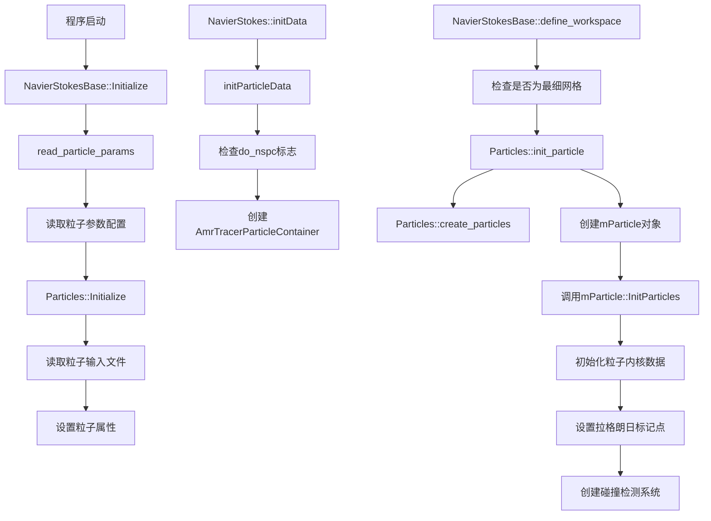
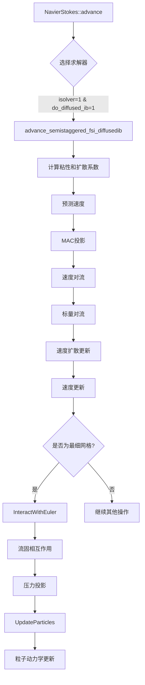
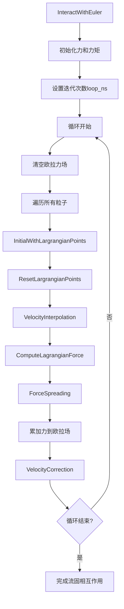
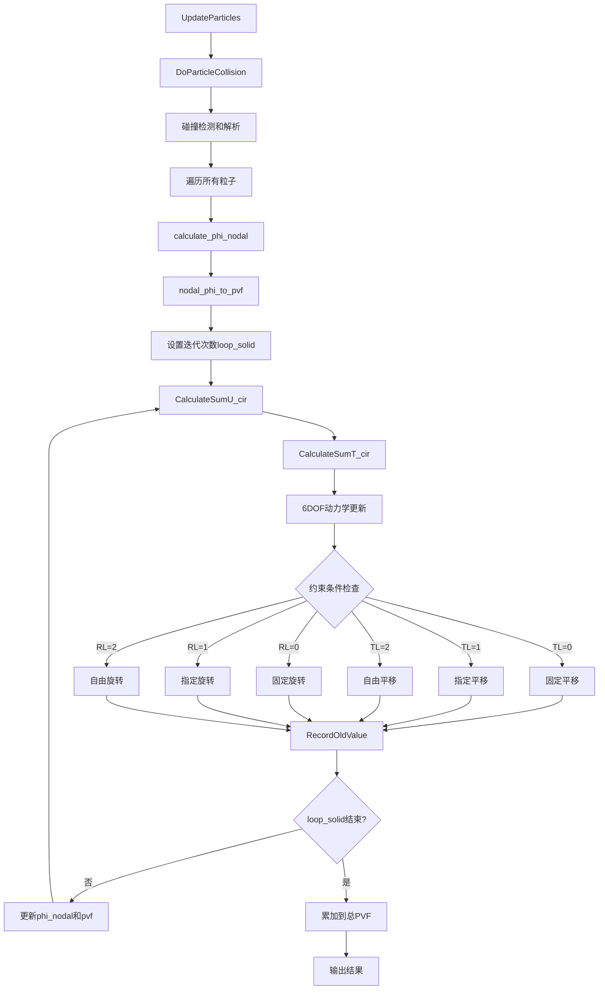
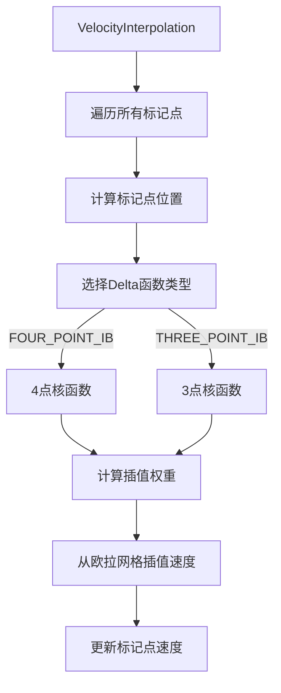
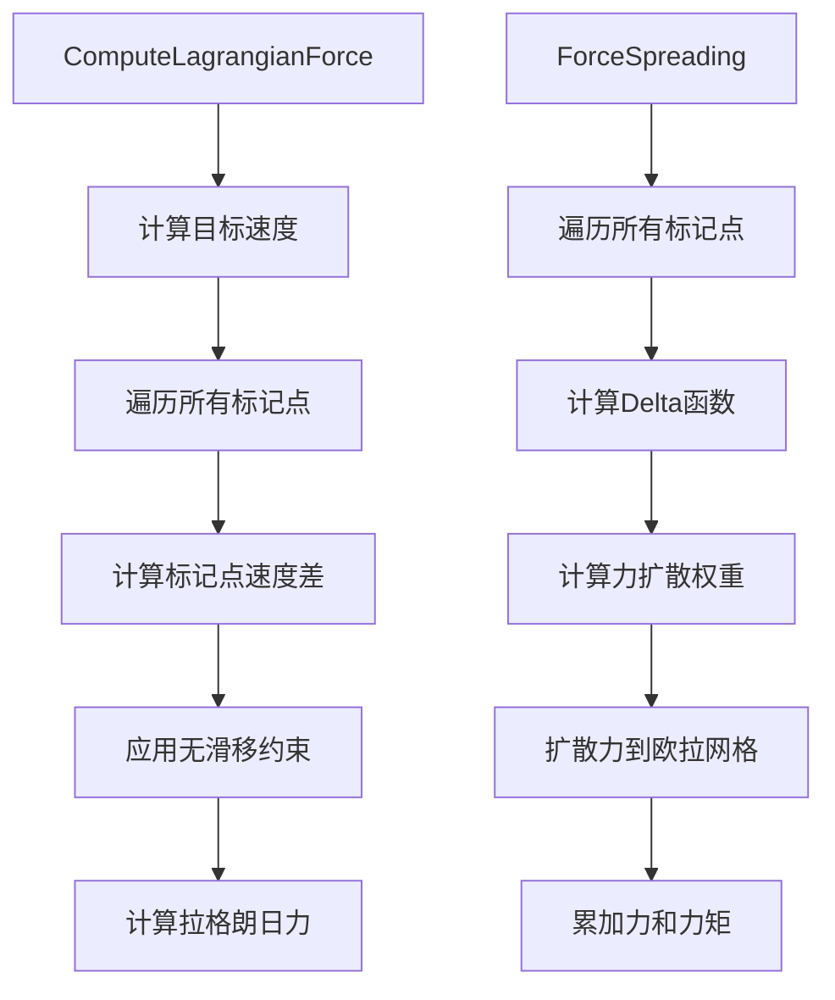
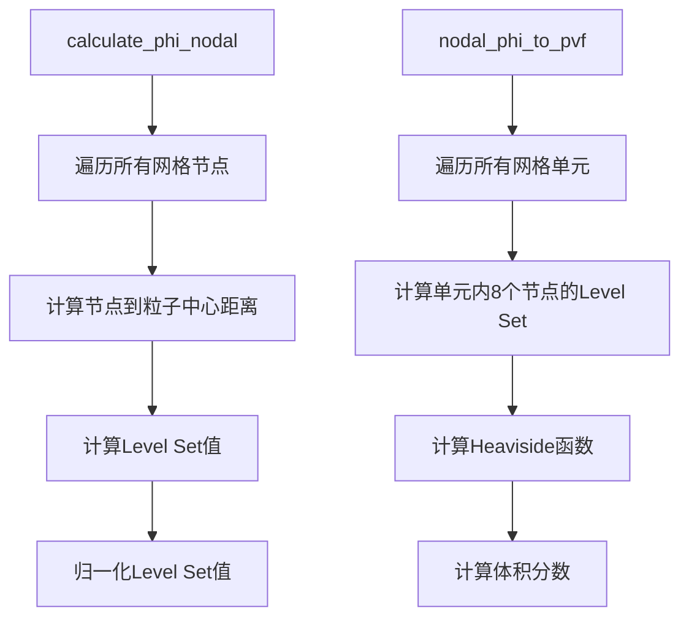

# IAMeX 粒子系统流程图

## 概述

本文档详细描述了IAMeX中扩散浸入边界方法(DIBM)粒子系统的函数调用关系和执行流程。该系统实现了流固耦合模拟，包括粒子初始化、流固相互作用、粒子动力学更新和碰撞处理等核心功能。

## 1. 初始化阶段 (Initialization Phase)

### 1.1 程序启动时的初始化流程



**详细说明：**

#### `read_particle_params()` - 粒子参数读取
- **位置**: `NavierStokesBase.cpp:3938`
- **功能**: 从输入文件读取粒子相关参数
- **主要参数**:
  - `do_nspc`: 是否启用粒子系统
  - `timestamp_dir`: 时间戳文件目录
  - `particle_init_file`: 粒子初始化文件
  - `particle_restart_file`: 粒子重启文件
  - `particles_in_plotfile`: 是否在输出文件中包含粒子信息

#### `Particles::Initialize()` - 粒子系统初始化
- **位置**: `DiffusedIB.cpp:1148`
- **功能**: 读取粒子配置文件并设置全局属性
- **主要操作**:
  - 读取粒子位置、速度、角速度
  - 设置约束条件(TL, RL)
  - 配置物理参数(密度、半径等)
  - 设置迭代参数(loop_ns, loop_solid)

#### `Particles::init_particle()` - 粒子内核初始化
- **位置**: `DiffusedIB.cpp:1013`
- **功能**: 创建粒子内核对象并初始化
- **调用**: `mParticle::InitParticles()`
- **主要操作**:
  - 创建mParticle对象
  - 初始化粒子内核数据
  - 设置拉格朗日标记点分布
  - 创建碰撞检测系统

#### `Particles::create_particles()` - 粒子容器创建
- **位置**: `DiffusedIB.cpp:961`
- **功能**: 创建AMReX粒子容器
- **主要操作**:
  - 创建mParticleContainer对象
  - 设置粒子属性数组
  - 初始化粒子位置

## 2. 时间推进阶段 (Time Advancement Phase)

### 2.1 主要推进函数调用流程



### 2.2 流固相互作用详细流程



**详细说明：**

#### `advance_semistaggered_fsi_diffusedib()` - FSI扩散浸入边界推进
- **位置**: `NavierStokes.cpp:2435`
- **功能**: 执行流固耦合的时间推进
- **主要步骤**:
  1. 计算粘性和扩散系数
  2. 预测速度场
  3. MAC投影
  4. 速度对流
  5. 标量对流
  6. 速度扩散更新
  7. 速度更新
  8. **流固相互作用** (仅在最细网格)
  9. 压力投影
  10. **粒子更新** (仅在最细网格)

#### `InteractWithEuler()` - 流固相互作用主函数
- **位置**: `DiffusedIB.cpp:235`
- **功能**: 执行流固相互作用的迭代求解
- **迭代机制**: 
  - 外循环: `loop_ns`次 (默认2次)
  - 内循环: 遍历所有粒子
- **核心操作**:
  1. **速度插值**: 从欧拉网格到拉格朗日标记点
  2. **力计算**: 计算拉格朗日力
  3. **力扩散**: 从拉格朗日标记点到欧拉网格
  4. **速度修正**: 修正欧拉速度场

## 3. 粒子更新阶段 (Particle Update Phase)

### 3.1 粒子动力学更新流程



**详细说明：**

#### `UpdateParticles()` - 粒子动力学更新主函数
- **位置**: `DiffusedIB.cpp:684`
- **功能**: 更新粒子的位置、速度和角速度
- **主要步骤**:
  1. **碰撞处理**: `DoParticleCollision()`
  2. **遍历粒子**: 对每个粒子执行更新
  3. **Level Set计算**: 计算粒子的Level Set函数
  4. **体积分数计算**: 计算粒子体积分数(PVF)
  5. **迭代求解**: `loop_solid`次迭代
  6. **6DOF动力学**: 更新平移和旋转运动
  7. **约束处理**: 根据TL/RL约束更新运动
  8. **记录旧值**: 保存当前状态为旧状态

#### `DoParticleCollision()` - 粒子碰撞处理
- **位置**: `DiffusedIB.cpp:844`
- **功能**: 检测和解析粒子间碰撞
- **主要操作**:
  1. 将粒子插入碰撞检测系统
  2. 执行碰撞模型(如DKT模型)
  3. 计算碰撞力和力矩
  4. 更新粒子的碰撞力

#### 6DOF动力学更新
- **平移约束(TL)**:
  - `TL[i] = 0`: 固定平移
  - `TL[i] = 1`: 指定平移
  - `TL[i] = 2`: 自由平移
- **旋转约束(RL)**:
  - `RL[i] = 0`: 固定旋转
  - `RL[i] = 1`: 指定旋转
  - `RL[i] = 2`: 自由旋转

## 4. 核心算法函数详解

### 4.1 速度插值 (Velocity Interpolation)



### 4.2 力计算和扩散 (Force Computation and Spreading)



### 4.3 Level Set和体积分数计算



## 5. 数据结构和关键变量

### 5.1 粒子内核结构 (kernel)
```cpp
struct kernel {
    int id;                           // 粒子ID
    RealVect location, velocity, omega;  // 位置、速度、角速度
    RealVect ib_force, ib_moment;     // 浸入边界力和力矩
    RealVect Fcp, Tcp;                // 碰撞力和力矩
    Real radius, rho, Vp;             // 半径、密度、体积
    int ml;                           // 标记点数量
    Vector<Real> phiK, thetaK;        // 球形标记分布
    IntVect TL, RL;                   // 平移和旋转约束
}
```

### 5.2 全局粒子属性 (ParticleProperties)
```cpp
namespace ParticleProperties {
    Vector<Real> _x, _y, _z;          // 粒子位置
    Vector<Real> Vx, Vy, Vz;          // 粒子速度
    Vector<Real> Ox, Oy, Oz;          // 粒子角速度
    Vector<Real> _radius;             // 粒子半径
    Vector<Real> _rho;                // 粒子密度
    Vector<int> TLX, TLY, TLZ;        // 平移约束
    Vector<int> RLX, RLY, RLZ;        // 旋转约束
    int loop_ns, loop_solid;          // 迭代次数
    int collision_model;              // 碰撞模型
    Real euler_fluid_rho;             // 流体密度
}
```

## 6. 关键参数和配置

### 6.1 输入文件参数
- **粒子配置文件**: 包含粒子位置、速度、物理属性
- **约束条件**: TL(平移约束)、RL(旋转约束)
- **迭代参数**: loop_ns(流固相互作用迭代)、loop_solid(粒子动力学迭代)
- **碰撞参数**: collision_model(碰撞模型类型)

### 6.2 数值参数
- **Delta函数类型**: FOUR_POINT_IB 或 THREE_POINT_IB
- **标记点分布**: 基于粒子半径和网格尺寸的球形分布
- **时间步长**: 由CFL条件和稳定性要求确定

## 7. 输出和监控

### 7.1 输出文件
- **粒子轨迹**: CSV格式的粒子位置、速度、力数据
- **力矩数据**: 浸入边界力和力矩的时间序列
- **可视化数据**: 粒子体积分数、Level Set函数

### 7.2 性能监控
- **计算时间**: 流固相互作用和粒子更新的耗时
- **收敛性**: 迭代收敛情况
- **稳定性**: 数值稳定性检查

## 8. 总结

IAMeX的粒子系统实现了一个完整的流固耦合模拟框架，主要特点包括：

1. **模块化设计**: 清晰的函数分离和职责划分
2. **迭代求解**: 多层次的迭代确保数值稳定性
3. **约束处理**: 灵活的6DOF约束系统
4. **碰撞检测**: 高效的粒子碰撞处理
5. **GPU加速**: 支持GPU并行计算
6. **可扩展性**: 易于添加新的物理模型

该系统的核心优势在于将复杂的流固耦合问题分解为可管理的子问题，通过迭代求解确保数值稳定性和物理准确性。 