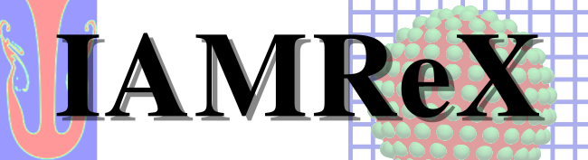

<div align="center">

<p align="center">
  <a href="https://arxiv.org/abs/2408.14140">
  
  </a>
</p>


[Overview](#Overview) -
[Features](#Features) -
[Examples](#Examples) -
[Install](#Install) -
[Acknowledgements](#Acknowledgements) -
[Contact](#Contact)

</div>


## Overview

IAMReX is a fork of the original [IAMR](https://github.com/AMReX-Fluids/IAMR) codebase that extends its capabilities for simulating multiphase incompressible flows and fluid-structure interaction problems on both CPUs and GPUs with/without subcycling. 

**Key additions to IAMR include:**
- **Level Set (LS) method** for capturing gas-liquid interfaces with reinitialization schemes
- **Multidirect forcing Immersed Boundary Method (IBM)** for resolving fluid-solid interfaces
- **Particle collision algorithms** with Discrete Element Method (DEM) and adaptive collision time model (ACTM) for particle-wall and particle-particle interactions

## Comparison with Base IAMR

| Feature | IAMR | IAMReX |
|---------|------|--------|
| State Variables | 4 (velocity, density, tracers, temperature) | 5 (adds level set) |
| Interface Methods | None | Level set, immersed boundary, phase field (TBD) |
| Particle Support | None | Full 6-DOF dynamics with collisions |
| Multi-Physics | Single-phase only | Multi-phase, fluid-solid interaction |
| Collision Detection | None | Spatial hashing with DKT model |
| GPU Support | Basic AMReX | Enhanced operations for resolved particles |

## Sample Cases

- [Reversed Single Vortex (RSV)](./Tutorials/RSV/)

- [Rayleigh-Taylor (RT) instability](./Tutorials/RayleighTaylor_LS/)

- [Cluster of monodisperse particles](./Tutorials/Monodisperse/)

For more details, please check the document: [sample-cases](https://ruohai0925.github.io/IAMReX/Introduction_Chapter.html#sample-cases)

## Installation

For detailed steps on downloading IAMReX, building and running the cases, see [Getting Started](https://ruohai0925.github.io/IAMReX/Getting_Started.html).

## State of the field

We made great efforts to simulate more complex multiphase flows at higher resolution using IAMReX. One effort is to combine the AMR technique with the multidirect forcing immersed boundary method to resolve particles only on the finest-level grid. It significantly reduces the grid requirements for particle-resolved simulation compared with commonly used uniform grid solvers [Incompact3d](https://github.com/xcompact3d/Incompact3d), [CaNS](https://github.com/CaNS-World/CaNS), and [CP3d](https://github.com/GongZheng-Justin/CP3d). Additionally, we utilized a subcycling technique to alleviate the time step constraint on coarser levels. It minimizes the total time step needed by time advancement compared with the non-subcycling technique used in other AMR-related packages, such as [IBAMR](https://github.com/IBAMR/IBAMR.git), [basilisk](http://basilisk.fr/), and [incflo](https://github.com/AMReX-Fluids/incflo.git).

## Get Help

You can also view questions
and ask your own on our [GitHub Discussions](https://github.com/ruohai0925/IAMReX/discussions) page.
To obtain additional help, simply post an issue.

## Contribute

We actively monitor the original IAMR repository and selectively merge upstream changes when they contain important bug fixes or feature improvements. We are always happy to have users contribute to the IAMReX source code. To
contribute, issue a pull request against the development branch.
Any level of changes are welcomed: documentation, bug fixes, new test problems,
new solvers, etc. For more details on how to contribute to IAMReX, please see
[CONTRIBUTING.md](CONTRIBUTING.md).

💡 If you're using IAMReX in your own GitHub projects, consider adding `IAMReX`
as a [repository topic](https://docs.github.com/en/repositories/managing-your-repositorys-settings-and-features/customizing-your-repository/classifying-your-repository-with-topics)!
This helps others discover related work and strengthens the IAMReX ecosystem.

## Citation

To cite IAMReX, please use

```
@article{10.1063/5.0236509,
    author = {Li, Xuzhu (李虚竹) and Li, Chun (李春) and Li, Xiaokai (李晓凯) and Li, Wenzhuo (李文卓) and Tang, Mingze (唐铭泽) and Zeng, Yadong (曾亚东) and Zhu, Zhengping (朱正平)},
    title = {An open-source, adaptive solver for particle-resolved simulations with both subcycling and non-subcycling methods},
    journal = {Physics of Fluids},
    volume = {36},
    number = {11},
    pages = {113335},
    year = {2024},
    month = {11},
    issn = {1070-6631},
    doi = {10.1063/5.0236509},
    url = {https://doi.org/10.1063/5.0236509},
    eprint = {https://pubs.aip.org/aip/pof/article-pdf/doi/10.1063/5.0236509/20247663/113335\_1\_5.0236509.pdf},
}

@inbook{doi:10.2514/6.2025-1865,
    author = {Dewen Liu and Shuai He and Haoran Cheng and Yadong Zeng},
    title = {Investigate the Efficiency of Incompressible Flow Simulations on CPUs and GPUs With BSAMR},
    booktitle = {AIAA SCITECH 2025 Forum},
    doi = {10.2514/6.2025-1865},
    URL = {https://arc.aiaa.org/doi/abs/10.2514/6.2025-1865},
    eprint = {https://arc.aiaa.org/doi/pdf/10.2514/6.2025-1865},
}

```

## License

This project complies with the [REUSE Specification](https://reuse.software/). Accordingly, the license header in each file specifies its copyright and licensing information. All licenses used in this project can be found in the LICENSES directory.

Licensing is determined as follows:

* LicenseRef-OpenSource refers to the [original IAMR license](https://github.com/AMReX-Fluids/IAMR/blob/development/OpenSource.txt), applies to all files originating from IAMR and any modifications made to them. 
* All new files created from scratch for IAMReX are licensed under the BSD-3-Clause.  

## Acknowledgements

We are grateful to Ann Almgren, Andy Nonaka, Andrew Myers, Axel Huebl, Marc Day, and Weiqun Zhang in the Lawrence Berkeley National Laboratory (LBNL) for their discussions related to [AMReX](https://github.com/AMReX-Codes/amrex) and [IAMR](https://github.com/AMReX-Fluids/IAMR). Y.Z. and Z.Z. also thank Prof. Lian Shen, Prof. Ruifeng Hu, and Prof. Xiaojing Zheng during their Ph.D. studies.

## Contact

If you have any question or wanna contribute to the code, please don't hesitate to contact us via the [GitHub Issues](https://github.com/ruohai0925/IAMReX/issues) or zdsjtu@gmail.com.
