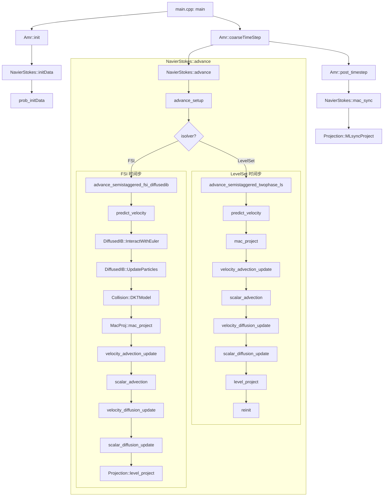

# IAMReX/Source 文件夹代码功能详解

## 1. 程序概述

`IAMReX/Source` 目录下的代码构成了一个高级的计算流体动力学（CFD）求解器，它基于AMReX自适应网格加密（AMR）框架。该程序主要用于模拟不可压缩多相流以及流固耦合（FSI）问题。

核心功能是求解**纳维-斯托克斯（Navier-Stokes）方程**，并集成了多种高级算法模块，包括：

-   **浸没边界法 (Immersed Boundary Method, IBM)**: 用于处理流体与复杂几何形状固体之间的相互作用。
-   **水平集方法 (Level Set Method)**: 用于追踪和捕捉多相流中的界面。
-   **粒子碰撞模型 (Particle Collision)**: 用于模拟流体中运动粒子之间的碰撞。
-   **大涡模拟 (Large Eddy Simulation, LES)**: 用于模拟湍流。

程序采用C++编写，并利用AMReX库实现大规模并行计算，支持CPU和GPU。

## 2. 核心架构与执行流程

程序的执行始于 `main.cpp`，它负责初始化AMR（Adaptive Mesh Refinement）环境，并驱动整个模拟过程。

### 2.1. 主执行流程 (`main.cpp`)

1.  **`amrex::Initialize(argc,argv)`**: 初始化AMReX环境和MPI。
2.  **`Amr* amrptr = new Amr(getLevelBld())`**: 创建一个 `Amr` 类的实例。`getLevelBld()` 返回一个 `NSBld` 对象，该对象负责创建各个加密层级（`AmrLevel`）的 `NavierStokes` 实例。
3.  **`amrptr->init(strt_time,stop_time)`**: 初始化AMR层级结构，包括网格生成和初始条件设定。
    -   在每个层级上，会调用 `NavierStokes::initData()`。
    -   `initData()` 内部调用 `prob_initData()` (位于 `prob/prob_init.cpp`) 来设置具体的物理问题初始条件（如速度场、密度场、温度场等）。
4.  **`amrptr->coarseTimeStep(stop_time)`**: 主时间步循环。在每个粗网格时间步内，会递归地调用所有更细层级的时间步进函数。
    -   每个层级的时间步进由 `NavierStokes::advance()` 函数控制。
5.  **`amrex::Finalize()`**: 结束程序，清理资源。

### 2.2. 单个时间步核心流程 (`NavierStokes::advance`)

`NavierStokes::advance` 函数是模拟的核心，它在一个时间步内协调调用各个物理模块的求解器。根据输入文件中的 `isolver` 参数，它会选择不同的求解路径：

-   `isolver = 0`: **两相流水平集方法** (`advance_semistaggered_twophase_ls`)
-   `isolver = 1`: **流固耦合浸没边界法** (`advance_semistaggered_fsi_diffusedib`)
-   `isolver = 2`: **两相流相场方法** (`advance_semistaggered_twophase_phasefield`) - 待实现

以最复杂的流固耦合（FSI）为例，其流程大致如下：

1.  **`advance_setup()`**: 准备工作，交换新旧时间层的数据。
2.  **`predict_velocity()`**: 预测速度场。
3.  **`m_pParticle->InteractWithEuler()`**: **(关键)** 执行浸没边界法（IBM）计算。
    -   `VelocityInterpolation()`: 从欧拉网格插值速度到拉格朗日粒子点。
    -   `ComputeLagrangianForce()`: 计算拉格朗日粒子上的力。
    -   `ForceSpreading()`: 将拉格朗日力弥散（插值）回欧拉网格。
    -   `VelocityCorrection()`: 根据IBM力修正欧拉速度场。
4.  **`m_pParticle->UpdateParticles()`**: **(关键)** 更新粒子的状态。
    -   `DoParticleCollision()`: 计算粒子间碰撞力。
    -   根据IBM力和碰撞力，求解粒子运动的6自由度（6-DOF）方程，更新粒子的位置和速度。
5.  **`mac_projector->mac_project()`**: 执行MAC投影，确保速度场满足无散度条件（质量守恒）。
6.  **`scalar_advection()` / `velocity_advection_update()`**: 对流更新标量（如密度、温度）和速度。
7.  **`scalar_diffusion_update()` / `velocity_diffusion_update()`**: 扩散更新标量和速度。
8.  **`level_projector->level_project()`**: 执行节点投影，将压力和速度场耦合求解。

## 3. 主要模块功能详解

### 3.1. `NavierStokes` / `NavierStokesBase` (核心求解器)

这是程序的主类，继承自 `amrex::AmrLevel`。

-   **`NavierStokes.H/.cpp`**: 派生类，处理具体的问题设置和高级流程控制。
-   **`NavierStokesBase.H/.cpp`**: 基类，包含求解纳维-斯托克斯方程所需的基础设施和通用函数。
-   **`NS_setup.cpp`**: 定义状态变量（速度、密度、温度、标量等）、派生变量（涡量、能量等）以及它们的边界条件。
-   **`NS_BC.H`**: 定义了各种物理边界条件（如无滑移壁面、入口、出口）到数值边界条件（如Dirichlet, Neumann）的映射。
-   **`NS_error.cpp`**: 定义了自适应网格加密的判据（例如，基于涡量大小或梯度）。
-   **`NS_getForce.cpp`**: 计算外力项，如重力引起的浮力。
-   **`NS_LS.cpp`, `NS_kernels.cpp`**: 包含水平集方法（Level Set）和相关核函数（如计算梯度、散度）的实现。
-   **`NS_LES.cpp`**: 包含大涡模拟（LES）模型的实现，用于计算亚格子湍流粘性。

### 3.2. `Projection` / `MacProj` (投影方法)

投影方法是求解不可压缩流的关键，用于解耦速度和压力，并保证速度场的无散度性。

-   **`Projection.H/.cpp`**: 实现**节点投影**（Nodal Projection）。它在每个时间步结束时被调用，以确保最终的速度和压力场是一致的。
    -   `level_project()`: 在单个AMR层级上执行投影。
    -   `initialVelocityProject()`: 在模拟开始时对初始速度场进行投影，确保其无散。
    -   `initialPressureProject()`: 在有重力时，计算初始的静水压力场。
-   **`MacProj.H/.cpp`**: 实现**MAC投影**（Marker-and-Cell Projection）。它作用于交错网格上的面心速度，主要用于预测步骤，确保中间速度场的无散度性。
    -   `mac_project()`: 在单个AMR层级上执行MAC投影。
    -   `mac_sync_solve()` / `mac_sync_compute()`: 处理多层级AMR网格间的同步问题。

### 3.3. `Diffusion` (扩散项求解器)

-   **`Diffusion.H/.cpp`**: 负责求解状态变量（速度、标量、温度）的扩散项。它内部使用AMReX的`MLMG`（Multilevel-Multigrid）线性求解器来求解隐式扩散方程。
    -   `diffuse_scalar()`: 求解标量的扩散。
    -   `diffuse_velocity()`: 求解速度的粘性项（动量扩散）。
    -   `getViscTerms()`: 计算粘性力项。

### 3.4. `DiffusedIB` (浸没边界法模块)

这是实现流固耦合的核心模块，采用的是一种弥散格式的直接力浸没边界法。

-   **`DiffusedIB.H/.cpp`**: 定义了`mParticle`类（代表固体颗粒）和`Fibers`类（代表柔性细丝），并实现了IBM的核心算法。
    -   `mParticle::InitParticles()`: 初始化固体的物理属性（位置、速度、密度、半径等）和拉格朗日标记点。
    -   `mParticle::InteractWithEuler()`: 核心函数，协调欧拉场和拉格朗日粒子间的相互作用。
    -   `mParticle::UpdateParticles()`: 求解粒子运动的6自由度方程，更新粒子状态。
-   **`DiffusedIB_Parallel.h/.cpp`**: 似乎是`DiffusedIB`的一个并行优化或重构版本，将一个大颗粒分解到多个处理器上进行计算。

### 3.5. `Collision` (碰撞模块)

-   **`Collision.H/.cpp`**: 实现粒子间的碰撞检测和碰撞力计算。
    -   `SetGeometry()`: 建立一个背景网格用于加速碰撞检测。
    -   `InsertParticle()`: 将`mParticle`对象注册到碰撞模块中。
    -   `GenerateCollisionPairs()`: 在背景网格的邻近单元中搜索可能的碰撞对。
    -   `ResolveCollisionPairs()` / `DKTModel()`: 根据指定的模型（如DKT模型）计算碰撞产生的接触力。

## 4. 函数调用关系图 (高层)

下面是一个简化的、高层次的函数调用关系图，展示了主要模块如何协同工作：

这个图表说明了：
-   程序从`main`开始，通过`Amr`类管理整个模拟。
-   `NavierStokes::advance`是每个时间步的核心驱动函数。
-   在FSI求解路径中，`DiffusedIB`和`Collision`模块被紧密调用，以处理流体和固体间的相互作用。
-   `MacProj`和`Projection`在每个时间步中都被调用，以保证流体的不可压缩性。
-   `Diffusion`模块在速度和标量的更新步骤中被隐式调用。

希望这份文档能帮助您理解这个复杂的模拟程序。
